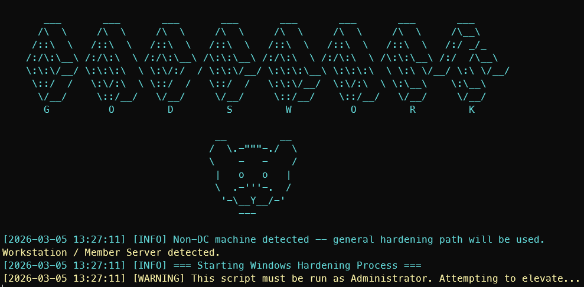

# Win-Hardening

<!-- Badges -->


> A Windows hardening automation framework built for the Collegiate Cyber Defense Competition (CCDC). Covers the full stack — OS, network, services, firewall, EDR — with additional Active Directory modules that activate automatically on Domain Controllers.



---

## Quick Start

```powershell
# Run as Administrator
.\Start-Hardening.ps1          # Interactive module selection
.\Start-Hardening.ps1 -All     # Run all modules automatically
.\Start-Hardening.ps1 -IncludeModule "Network","Firewall"  # Run specific modules
```

## Recovery

```powershell
.\Restore-State.ps1    # Interactive restoration from pre/post hardening backups
.\Decrypt-Secrets.ps1  # Decrypt rotated password files
```
